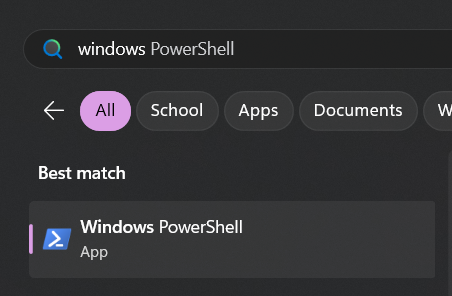
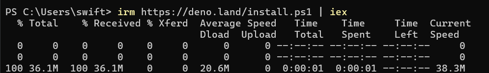
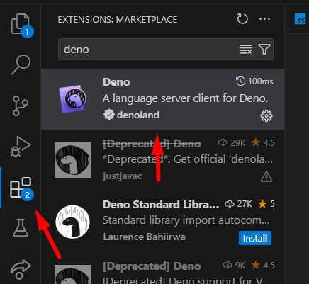
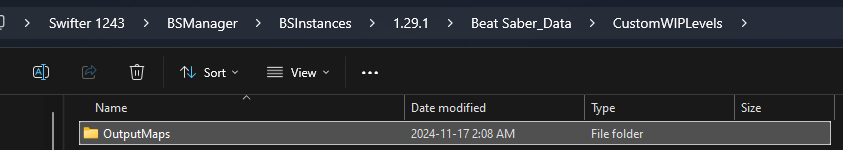

# Instalace ReMapper

Zde je návod, co musíte udělat jednorázově na vašem systému!

## Instalace Deno

ReMapper vyžaduje Deno pro svojí funkčnost. Deno je runtime, takže kompiluje a spouští TypeScript kód.

1. Otevřete Windows Powershell terminál:



2. Poté vložte následující příkaz do terminálu a nechte ho nainstalovat:

```bash
irm https://deno.land/install.ps1 | iex
```



## VSCode Plugin

Pokud používáte VSCode, budete potřebovat také nainstalovat rozšíření. Přejděte do záložky rozšíření a nainstalujte Deno.



## Nastavení Výstupního Playlistu

Při spouštění skriptů budete získávat "výstupní" kopii vaší mapy. Budete potřebovat, aby se tyto mapy objevily v playlistu/složce, kterou můžete hrát ve hře.

1. Najděte složku `Beat Saber_Data/CustomWIPLevels` a vytvořte v ní složku `OutputMaps`.
2. Najděte soubor `UserData/SongCore/folders.xml` a otevřete ho v textovém editoru.
3. Vložte následující kód:

```xml
<folders>
  <folder>
    <Name>Output Maps</Name>
    <Path>vaše cesta zde</Path>
    <Pack>2</Pack>
    <WIP>True</WIP>
  </folder>
</folders>
```

Musíte nahradit "vaše cesta zde" cestou ke složce OutputMaps, kterou jste vytvořili.

!!! warning "Upozornění"
    Playlist se nezobrazí, pokud neobsahuje žádné mapy! Zkuste do něj vložit mapu pro otestování funkčnosti.

 

## Další Nástroje

### Blender Exporter

Pokud plánujete importovat primitivní objekty z Blender scén do mapy, budete potřebovat ReMapper Blender Exporter. Instrukce k instalaci tohoto pluginu najdete [zde](https://github.com/Swifter1243/ReMapper/blob/master/BlenderExporter).

### Auto Script Refresh

Pokud chcete, aby se váš skript automaticky aktualizoval při uložení nebo když se změní klíčové soubory (VELMI DOPORUČENO!), budete chtít nainstalovat Denon.

Pro instalaci spusťte tento příkaz v Powershell okně:

```bash
deno install -qAf --unstable --global https://deno.land/x/denon/denon.ts
```

Pokud dostanete chybu typu "`<cesta>` cannot be loaded because running scripts is disabled on this system", zkuste spustit tento příkaz:

```bash
Set-ExecutionPolicy RemoteSigned -Scope CurrentUser
```

A poté znovu spusťte instalační příkaz.
