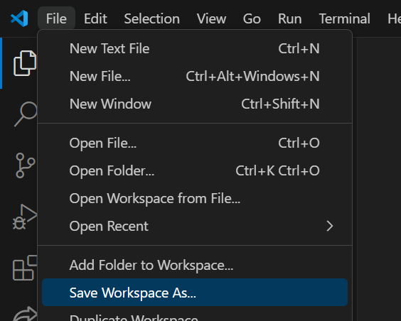
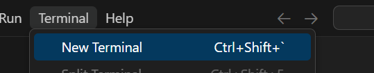
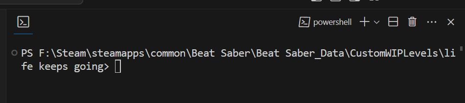
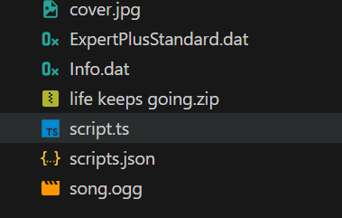
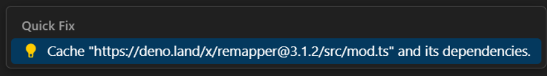

# Nastavení map

Zde je návod, co musíte udělat pro každou mapu zvlášť!

## Nastavení pracovního prostoru

Tento tutoriál používá Visual Studio Code.

Pojďme nastavit náš pracovní prostor! V programu VSCode jděte do File > Open Folder. Najděte mapu, na které budete pracovat, a dvakrát na ni klikněte.


V průzkumníku souborů byste měli vidět hierarchii mapy. Pokud ji nevidíte, klikněte na ikonu, na kterou ukazuje červená šipka.


Je velmi důležité, aby VSCode rozpoznal, že pracujeme v této složce. Mnoho věcí závisí na tom, že je naše mapa považována za pracovní prostor. Dokonce můžeme uložit stav našeho okna jako soubor, takže ho můžeme jednoduše znovu otevřít dvojklikem, kdykoli se k němu budeme chtít vrátit.

Jděte do File > Save Workspace As... a uložte soubor do složky s vaší mapou.


Nakonec řekneme VSCode, že pro tento projekt používáme Deno.

Otevřete paletu příkazů pomocí Ctrl + Shift + P a vyhledejte Deno: Enable. Klikněte na něj a potvrďte vše.



## Přidání skriptových souborů

Nyní je čas použít náš nástroj pro nastavení!

Jděte do Terminal > New Terminal pro otevření integrovaného Powershell okna ve složce vaší mapy.



Pokud jste vše udělali správně, měli byste vidět cestu k vašemu projektu v okně terminálu.



Nyní spusťte příkaz pro nastavení. Pokud se spustí úspěšně, měli byste vidět nové soubory ve vaší hierarchii! Klikněte na soubor script.ts.



Toto bude váš základní skript, kde budete provádět změny v beatmapě.

## Spuštění skriptu

Pokud používáte nejnovější verzi ReMapper poprvé, odkaz v příkazu `import * as rm` vám způsobí problémy s hlášením, že závislost není vyřešena! To proto, že Deno ukládá balíčky do mezipaměti na vašem počítači, ale ne automaticky.

Pro uložení balíčku ReMapper do mezipaměti na vašem počítači najeďte myší nad URL v příkazu a držte alt. Měli byste vidět možnost Quick Fix. Klikněte na ni a vyberte možnost, která vám umožní uložit závislost do mezipaměti.

 

Pro spuštění skriptu máme dvě možnosti, obě se zadávají do terminálu:

### Standardní Deno

```bash
deno run --no-check --allow-all script.ts
```

S touto metodou budete muset spustit tento příkaz v terminálu pokaždé, když budete chtít spustit skript. Nicméně můžete v terminálu stisknout šipku nahoru na klávesnici pro zobrazení stejného příkazu znovu!

### Denon

```bash
denon rm
```

Toto zavolá soubor scripts.json, který by měl být ve vaší složce s mapou, aby automaticky spustil příkaz Deno pokaždé, když se aktualizují klíčové soubory. Toto se spustí i když uložíte váš script.ts (Ctrl + S) bez jakýchkoliv změn!
