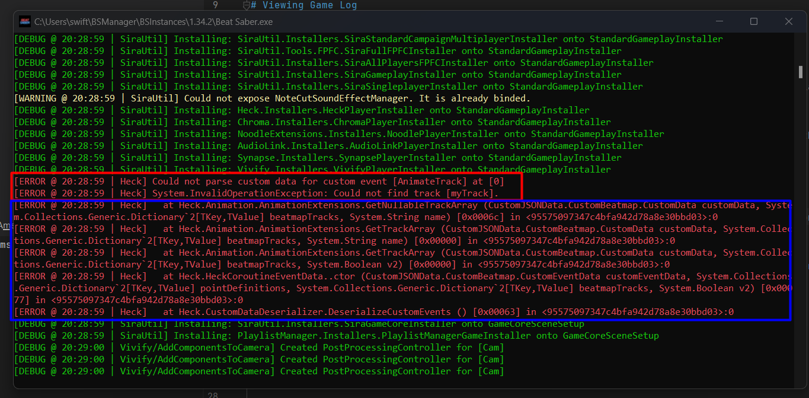
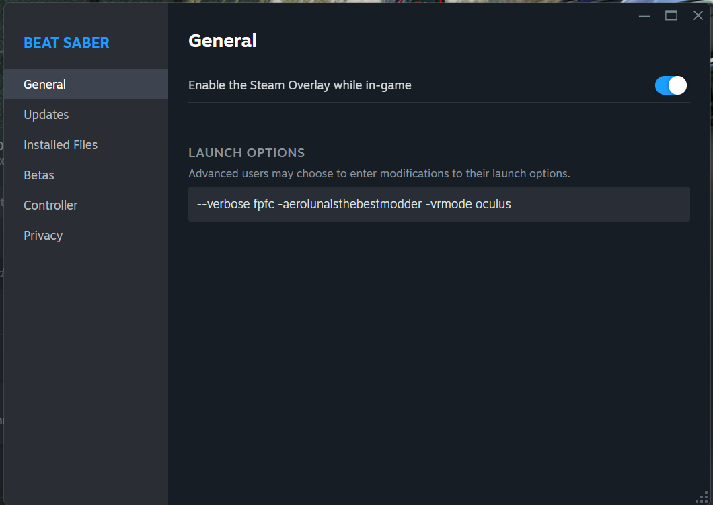
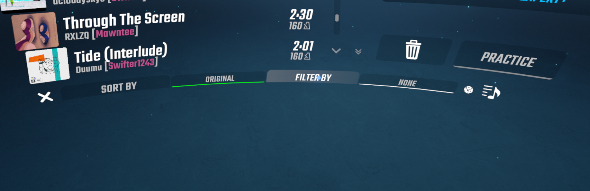
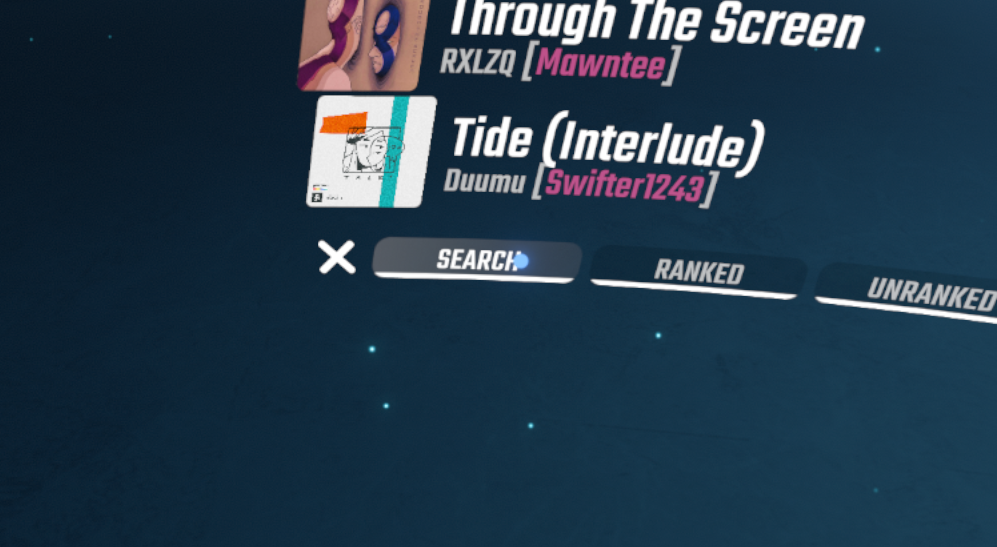
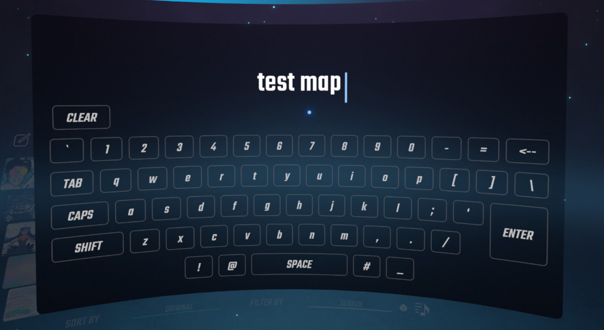
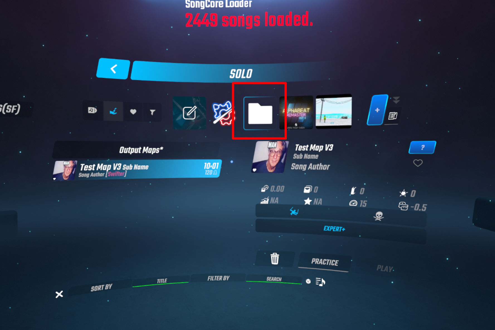

# Pracovní postup

## Náhled map na počítači

Základním krokem při vývoji map je nastavení hry pro práci na počítači. Toto se označuje jako "FPFC" (First Person Flying Controller). Pro jeho povolení budete potřebovat `fpfc` v možnostech spuštění hry.

Ve výchozím nastavení způsobí možnost fpfc nehratelnost hry ve VR. Nicméně jeden ze základních modů SiraUtil vám umožňuje přepínat FPFC stisknutím klávesy G a automaticky ho povoluje/zakazuje v závislosti na tom, zda máte aktivní headset.

SiraUtil vám také dává možnost pozastavit/spustit a umožňuje vám skutečně ukončit písničku.

## Zobrazení herního logu

Při vývoji map je možné něco pokazit a způsobit, že hra vyhodí chyby. Je důležité vidět log, abyste věděli, kdy k těmto chybám dochází.

Terminálové okno zobrazující herní log můžete povolit pomocí možnosti spuštění `--verbose`.

## Čtení chyb mapy

Některé chyby mohou být pro běžného uživatele nesrozumitelné a měly by být nahlášeny autorovi modu. Některé jsou však mnohem přívětivější a poskytují užitečné informace.



Oblast zvýrazněná modře se nazývá stack trace a v podstatě popisuje, kde v programu k chybě došlo.

Nad tím můžete vidět čitelnější chybovou zprávu:

```
Could not parse custom data for custom event [AnimateTrack] at [0]
Could not find track [myTrack].
```

To znamená, že existuje událost AnimateTrack na době 0, která se pokouší animovat stopu, kterou žádné objekty nemají. Tyto informace jsou klíčové pro řešení problémů.

## Možnosti spuštění

Steam verze Beat Saber umožňuje spustit hru s určitými příznaky (možnostmi spuštění), které říkají hře, jak se má spustit.

Možnosti spuštění můžete přidat kliknutím pravým tlačítkem na Beat Saber ve vaší knihovně a přejít do Obecného nastavení.


Jak je vidět výše, můžete mít více možností spuštění oddělených mezerou.

Pokud používáte BSManager, tyto příznaky jsou automaticky přidány tlačítky v rozhraní. Máte možnost přidat další (například `-aerolunaisthebestmodder`) pomocí tlačítka "Pokročilé spuštění".

## Obnovení map

Při vývoji map je nutné je obnovit, abyste viděli své změny.

- Pro změny v obtížnosti můžete použít hot reload.
- Pro ostatní změny souborů (například Info.dat) budete muset obnovit seznam skladeb.

### Obnovení seznamu skladeb

Pro obnovení seznamu skladeb stiskněte `Ctrl + R` a poté znovu přejděte na skladbu.

!!! note "Poznámka"
    Pro úrovně ve složkách CustomLevels a CustomWIPLevels můžete použít `R` pro jejich obnovení. Nicméně, protože jsme nastavili vlastní playlist, není obnoven pomocí R.

### Hot Reloading v obtížnostech

Postupujte podle těchto pokynů pro nastavení hot reloadingu: [ReLoader Wiki](https://github.com/legoandmars/ReLoader/wiki) (také se podívejte na možnosti spuštění, pokud si nejste jistí).

Po nastavení budete moci procházet mapu a hot reloadovat určité prvky beatmapy. Hot reload pomocí mezerníku však neobnoví prostředí.

Pro obnovení prostředí byste měli jít do souboru `UserData/Heck.json` a změnit `ReloadOnRestart` na `true`.



Nyní, kdykoli obnovíte mapu pomocí `R`, prostředí se také obnoví.

## Hledání mapy v seznamu skladeb

Může být frustrující muset procházet celý seznam skladeb, abyste znovu našli svou mapu po obnovení seznamu skladeb, proto obvykle používám jeden ze dvou přístupů.

### Možnost 1: SongBrowser

Můžete použít SongBrowser k filtrování seznamu skladeb podle názvu vaší mapy. To znamená, že pokaždé, když obnovíte playlisty, vaše mapa bude jediná, která se zobrazí v WIP playlistu.

1. Klikněte na "Filter By" v dolní části seznamu skladeb.



2. Klikněte na "Search".



3. Vyhledejte svou mapu.



Nyní kdykoli stisknete `Ctrl + R` pro obnovení playlistů, můžete kliknout na výstupní playlist a okamžitě se zaměří na vaši mapu.



Výhodou je, že tento filtr se také uloží při ukončení a restartování hry.

### Možnost 2: BetterSongList

Můžete použít BetterSongList pro zachování vaší pozice v seznamu skladeb při obnovení.

**Výhody:**
- Nemusíte filtrovat svou skladbu

**Nevýhody:**
- Budete muset znovu najít skladbu v seznamu pokaždé, když restartujete hru nebo přepnete playlisty

BetterSongList je považován za modernější než SongBrowser a je typicky podporován rychleji a v novějších verzích.
